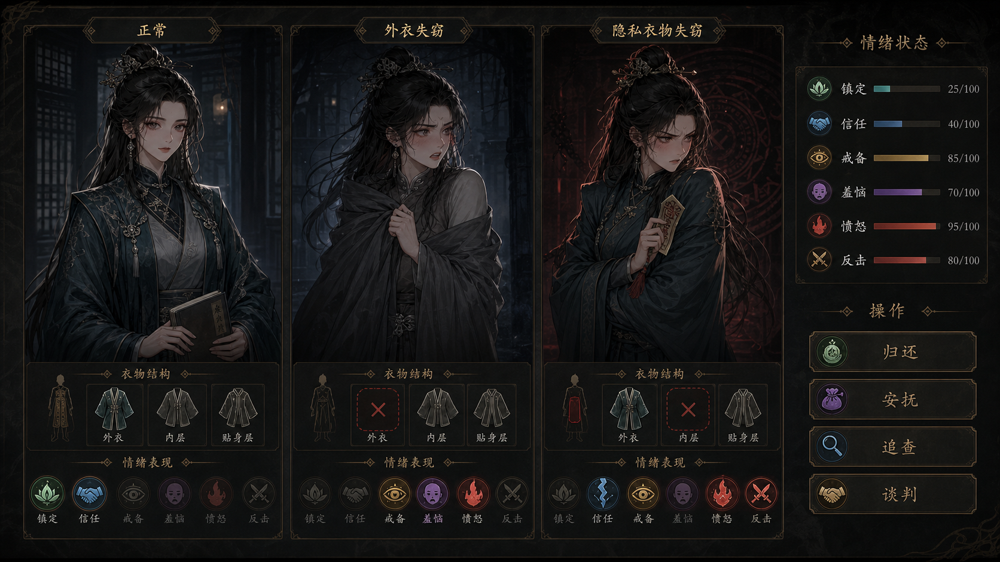

# 《蛊真人：天外盗剧本》成人角色状态立绘与角色 UI 规范

## 1. 文档目的

本规范定义 MVP 中重要成年角色的角色界面、服装失窃状态、情绪表现和互动反馈。它同时约束 UI、美术、剧情和程序数据，确保状态变化由角色立绘直接表达，而不是只替换标签或数值。

本规范已确认采用“中度动态立绘”方案：

- 每名角色至少制作三张独立状态立绘。
- 状态切换必须同时改变表情、视线、姿态、手势、服装层和光色中的至少四项。
- 情绪数值只解释立绘，不代替立绘表演。
- MVP 使用静态分状态立绘，不制作 Live2D 连续动画。

参考效果图：



参考图只用于确认三态的表情、姿态、服装轮廓和光色差异，不作为槽位文字、数值或实际布局的制作依据。参考图第三栏将“内层”画成缺失属于概念图文字误差；正式规则必须是 `privacy` 缺失、`inner` 仍装备。

参考图是美术验收对照页，不是实际运行时同时展示三个状态的页面。游戏运行时只显示角色当前状态。

## 2. 适用范围

首批覆盖五名明确成年的女性角色。前三名是完整缘线角色，后两名是功能角色；五名角色都制作三态 UI，但功能角色在 MVP 中不展开完整关系线。

| 角色 ID | 角色定位 | MVP 功能 |
| --- | --- | --- |
| `npc_clan_steward` | 家族成年女执事 | 蛊室权限、排班、令牌、家族资源 |
| `npc_caravan_manager` | 商队成年女管事 | 交易、账册、身份、离山路线 |
| `npc_demonic_cultivator` | 成年魔道女蛊师 | 传承、禁忌情报、高风险共谋 |
| `npc_medicine_physician` | 成年药堂女医师 | 治疗、负面状态、蛊虫反噬 |
| `npc_tavern_keeper` | 成年酒馆老板娘兼情报掌柜 | 流言、酒虫线索、情报交易 |

所有可进入该系统的角色必须满足：

- 角色设定年龄不低于 18 岁。
- 数据中存在显式成年标记。
- 角色拥有独立的服装槽、情绪数据和事件记录。

## 3. 核心设计原则

### 3.1 立绘承担第一层叙事

玩家隐藏所有文字、数值和状态图标后，仍应能区分：

1. 正常。
2. 外衣失窃。
3. 隐私衣物失窃。

如果只能依靠标题或红色叉号判断状态，则该立绘不合格。

### 3.2 同一角色身份必须稳定

同一角色的三张立绘必须保持：

- 相同面部结构、年龄感和体型。
- 相同发型主体、标志性发饰和主色。
- 相同职业识别物，如账册、药囊、酒壶或蛊虫容器。
- 相同绘画精度、镜头距离和身体比例。

状态变化不能让角色看起来像换了一个人。

### 3.3 情绪必须改变行为

情绪不只是面部表情。每次状态切换至少改变以下四类视觉信息：

- 眉眼和嘴形。
- 视线方向。
- 肩颈和躯干朝向。
- 双手动作。
- 服装穿着方式。
- 环境光、轮廓光或背景压迫感。

### 3.4 失窃表现保持克制

失窃状态用于表达风险、关系破坏和后续反制，不使用裸露或色情化画面。

- 不展示裸体、内衣实物或透明衣料。
- 不使用强调身体部位的镜头。
- 外衣失窃时使用完整不透明中衣和临时披肩维持遮蔽。
- 隐私衣物失窃时保留完整闭合外袍，由姿态、表情和服装槽位说明事件。
- 隐私槽只使用抽象衣物图标或着装完整的人形轮廓。

## 4. 运行时角色界面

### 4.1 信息层级

运行时界面分为五个区域：

1. 角色列表：头像、身份、关系摘要和未处理事件标记。
2. 主立绘：显示当前状态对应的唯一立绘。
3. 情绪状态：显示镇定、信任、戒备、羞恼、愤怒和反击。
4. 服装与失窃记录：显示槽位状态、发现时间、嫌疑和证据。
5. 互动区：根据条件显示归还、安抚、追查和谈判。

主立绘必须是页面第一视觉焦点，面积不得小于角色详情主体区域的 45%。

### 4.2 运行时与验收页的区别

- 运行时：只显示当前状态，不允许玩家手动切换“正常、外衣失窃、隐私衣物失窃”。
- 美术验收页：同一角色三态并排，用于检查身份一致性和状态差异。
- 调试页：允许开发人员切换状态、情绪阈值和服装槽，正式版本不显示。

### 4.3 响应式要求

- 主要目标分辨率为 1920×1080 和 2560×1440。
- 最低支持 1366×768，主立绘不得被情绪面板遮挡。
- 情绪标签允许缩短为图标加数值，但主立绘不得因空间不足退化为小头像。
- 操作按钮使用图标加短文字，按钮状态不得改变整体布局尺寸。

## 5. 三种基础状态

### 5.1 正常

立绘要求：

- 穿着完整职业服装。
- 肩背自然，身体朝向玩家或主要交互目标。
- 视线稳定，嘴形克制。
- 手中持有职业识别物。
- 使用中性或偏冷环境光。

服装槽：

- 外衣：已装备。
- 内层：已装备。
- 隐私层：已装备。

情绪特征：

- 镇定通常为主导项。
- 信任取决于长期关系。
- 戒备、羞恼、愤怒和反击保持角色基础值。

### 5.2 外衣失窃

立绘要求：

- 正式外袍明显缺失。
- 角色穿完整、高领、不透明中衣，并临时裹紧披肩或备用斗篷。
- 肩部内收，身体略微避开玩家。
- 一只手固定领口或披肩，另一只手准备取令牌、蛊虫或武器。
- 视线搜索周围威胁，表情呈现警惕和受辱后的怒意。
- 光线更冷，阴影更硬。

服装槽：

- 外衣：`missing`，红色缺失标记。
- 内层：已装备。
- 隐私层：已装备。

首次发现该事件时应用以下基础修正：

| 数值 | 基础修正 |
| --- | ---: |
| 镇定 | -25 |
| 戒备 | +35 |
| 羞恼 | +40 |
| 愤怒 | +20 |
| 反击 | +15 |
| 信任 | 确认玩家为嫌疑人时 -10 |

### 5.3 隐私衣物失窃

立绘要求：

- 外袍仍完整、闭合并系紧，不以裸露表达缺失。
- 身体明显转开，抱臂、防御或握住护身物。
- 眉头紧锁、目光拒绝接触或直接锁定嫌疑人。
- 表情应比外衣失窃更强烈，表现信任破裂、羞怒和反制意图。
- 使用克制的红色轮廓光、封锁纹样或敌对背景反馈。

服装槽：

- 外衣：已装备。
- 内层：已装备。
- 隐私层：`missing`，只显示抽象缺失标记。

首次发现该事件时应用以下基础修正：

| 数值 | 基础修正 |
| --- | ---: |
| 镇定 | -40 |
| 戒备 | +50 |
| 羞恼 | +55 |
| 愤怒 | +45 |
| 反击 | +35 |
| 信任 | 确认玩家为嫌疑人时 -25 |

同一事件的发现修正只应用一次。事件修正最终值必须限制在 0-100。角色反应系数可改变修正幅度，不能消除状态立绘变化。

## 6. 情绪视觉系统

### 6.1 六项显示指标

| 指标 | 数据来源 | 主要视觉信号 |
| --- | --- | --- |
| 镇定 | 短期情绪 | 呼吸感、肩颈、嘴形、动作稳定度 |
| 信任 | 长期关系 | 关系徽记、可用操作和对话反馈；MVP 不额外切换立绘 |
| 戒备 | 短期情绪 | 侧身、搜索视线、手靠近武器或蛊虫 |
| 羞恼 | 短期情绪 | 回避视线、面部热色、收紧衣物、动作僵硬 |
| 愤怒 | 短期情绪 | 眉眼压低、下颌收紧、握拳、硬质轮廓光 |
| 反击 | 行为倾向 | 护身物、武器准备、封锁背景、主动逼近或撤离 |

信任属于长期关系值，其余五项属于当前情绪或行为倾向。它们可以同屏显示，但程序数据必须分开存储。

### 6.2 强度阈值

| 数值区间 | 表现要求 |
| --- | --- |
| 0-24 | 图标弱化，不增加额外画面反馈 |
| 25-49 | 图标与数值正常显示 |
| 50-74 | 对应情绪条高亮，状态边框使用该情绪色 |
| 75-100 | 对应情绪条强化；愤怒或反击达到该区间时显示共享的全画布敌对 UI 特效层 |

完整表情、姿态、手势和服装变化由三种基础状态立绘承担，不随每个情绪数值点连续插值。情绪阈值只控制 UI 强度、边框和共享敌对特效层，因此 MVP 的三张基础立绘即可覆盖人物表演要求。

### 6.3 主导情绪解析

程序按以下顺序选择表现：

1. 先根据已发现的服装事件选择基础状态立绘。
2. 从镇定、戒备、羞恼、愤怒和反击中选出最高值作为主导情绪。
3. 第二高值作为辅助情绪，控制次级图标高亮。
4. 信任只改变关系提示和可用操作，不覆盖事件状态或基础立绘。

同值时按 `反击 > 愤怒 > 戒备 > 羞恼 > 镇定` 决胜。每张状态立绘必须覆盖该事件的默认表演；当愤怒或反击达到 75 时，必须叠加共享敌对特效层和红色边框。该特效只包含边框、轮廓光和背景封锁纹样，不替换面部或身体部件。

### 6.4 确定性修正规则

情绪修正公式：

```text
新值 = clamp(旧值 + round(事件基础修正 × 角色反应系数), 0, 100)
```

信任属于长期关系值，不乘情绪反应系数。只有 `owner_awareness` 首次转换为 `culprit_confirmed` 且确认对象为玩家时，才应用事件表中的信任降低。每条事件用 `trust_penalty_applied_at` 记录结算时间；已有值时不得再次降低信任。

每日结算时，短期情绪按固定速度回归角色基础值：

- 镇定：每日至多回升 5。
- 戒备：每日至多下降 3。
- 羞恼：每日至多下降 5。
- 愤怒：每日至多下降 3。
- 反击：存在未解决失窃事件时不衰减；全部解决后每日至多下降 5。

重复读取、读档或重复打开角色界面不得再次应用发现修正。每条事件使用 `emotion_applied_at` 记录是否已经结算。

## 7. 五名角色的差异化表演

五名角色不能使用同一套“脸红、抱胸、愤怒”模板。

| 角色 | 正常 | 外衣失窃 | 隐私衣物失窃 |
| --- | --- | --- | --- |
| 家族女执事 | 端正、谨慎、持账册 | 压住慌乱，护住披肩并检查出入口 | 羞怒但保持官面克制，握令牌准备封库追查 |
| 商队女管事 | 自信、精明、观察交易对象 | 先确认损失，视线在玩家与货物间快速判断 | 表情冷硬，立即重算利益关系并准备扣押、谈判或离营 |
| 魔道女蛊师 | 松弛危险、带试探性笑意 | 羞恼较低，杀意和戒备更高，手已靠近蛊虫 | 不回避，直接锁定嫌疑人，反击值显著高于其他角色 |
| 药堂女医师 | 冷静、专业、持药箱或药册 | 震惊后迅速恢复秩序，检查是否存在药物或蛊虫痕迹 | 防御和不安更明显，优先封闭空间并进行证据检查 |
| 酒馆老板娘 | 热络但保持距离，观察所有客人 | 社交面具出现裂缝，边遮掩边判断流言来源 | 将羞恼转化为公开施压和情报报复，可能故意放出假消息 |

角色反应系数：

| 角色 | 镇定变化 | 戒备 | 羞恼 | 愤怒 | 反击 |
| --- | ---: | ---: | ---: | ---: | ---: |
| 家族女执事 | 0.8 | 1.1 | 0.9 | 0.9 | 1.0 |
| 商队女管事 | 0.8 | 1.1 | 0.7 | 1.0 | 1.2 |
| 魔道女蛊师 | 0.5 | 1.2 | 0.4 | 1.3 | 1.5 |
| 药堂女医师 | 0.7 | 1.1 | 1.0 | 0.8 | 0.7 |
| 酒馆老板娘 | 0.9 | 1.0 | 0.8 | 1.1 | 1.2 |

角色基础情绪与谈判配置：

| 角色 | 镇定 | 戒备 | 羞恼 | 愤怒 | 反击 | `pragmatic` |
| --- | ---: | ---: | ---: | ---: | ---: | --- |
| 家族女执事 | 60 | 25 | 0 | 10 | 10 | `false` |
| 商队女管事 | 70 | 35 | 0 | 10 | 15 | `true` |
| 魔道女蛊师 | 60 | 50 | 0 | 25 | 35 | `true` |
| 药堂女医师 | 75 | 25 | 0 | 5 | 5 | `false` |
| 酒馆老板娘 | 65 | 40 | 0 | 10 | 20 | `true` |

## 8. 服装、道具与失窃记录

### 8.1 服装槽

MVP 使用三层服装槽：

- `outer`：外袍、制服、斗篷。
- `inner`：完整不透明的中衣或内衬。
- `privacy`：隐私衣物，只以抽象槽位表示。

每个槽位支持：

- `equipped`
- `missing`

### 8.2 物品必须真实存在

服装失窃不是单独的剧情标签。对应物品必须进入物品和所有权系统：

- 物品有唯一 ID、原主人、当前持有者和品质。
- 偷盗成功后立即更新持有者、实际装备槽并生成失窃事件。
- 归还对应物品后恢复实际装备槽并关闭对应失窃事件。
- 读档后物品、槽位、失窃记录和角色状态必须一致。

### 8.3 事件发现

系统必须分开保存客观事实与角色认知：

- `clothing_slots` 是客观事实，偷盗结算后立即变为 `missing`。
- `incidents[].owner_awareness` 是角色认知，决定情绪和立绘。
- 角色 UI 的服装面板显示玩家已知的客观状态；角色未发现时附加“尚未察觉”标记。

MVP 中该类事件都由玩家触发，因此玩家始终知道实际槽位状态，不额外实现玩家知识迷雾。

认知状态：

- `unaware`：物品已转移、实际槽位已缺失，但角色不获得事件情绪修正，立绘不因该事件改变。
- `aware`：应用一次情绪修正，并根据最高严重度的已发现事件切换立绘。
- `culprit_confirmed`：角色确认嫌疑人，应用信任降低并允许进入反击逻辑。

若多个槽位同时缺失，运行时选择严重度最高的状态立绘，并在服装面板标出全部缺失槽位。

事件状态只使用：

- `open`：物品仍缺失。
- `returned`：对应物品已归还并恢复槽位。事件保留在历史记录中，`resolution` 写为 `returned`。

## 9. 互动操作

按钮可见性与启用条件必须由程序统一计算，UI 不自行判断。

| 操作 | 可见条件 | 启用条件 | 本规范内的确定结果 |
| --- | --- | --- | --- |
| 归还 | 存在 `open` 事件 | 玩家持有该事件的 `missing_item_id` | 物品归还原主人；槽位恢复 `equipped`；事件变为 `returned`；角色已发现时镇定 +10、戒备 -10、羞恼 -10、愤怒 -15、反击 -10，未发现时不改情绪 |
| 安抚 | 事件为 `aware` 或 `culprit_confirmed` | `suspicion_of_player < 60`、`anger < 80`，且该事件未使用过安抚 | 镇定 +10、羞恼 -10、愤怒 -5；设置 `soothe_used=true` |
| 追查 | 事件为 `aware` 或 `culprit_confirmed` | `suspicion_of_player < 75` 或 `trust >= 50` | 发出 `START_INCIDENT_INVESTIGATION`，参数为事件 ID；实际任务由任务系统创建 |
| 谈判 | 事件为 `aware` 或 `culprit_confirmed` | `anger < 90`，且 `trust >= 30` 或角色配置 `pragmatic=true` | 发出 `OPEN_INCIDENT_NEGOTIATION`，参数为事件 ID；实际对话结果由剧情配置处理 |

数值结果统一限制在 0-100。归还操作只处理本次事件关联的单件物品；多件失窃物必须分别归还。

当 `anger >= 90`、`retaliation >= 80` 且 `suspicion_of_player >= 80` 时，角色进入完全敌对。此时安抚、追查和谈判禁用；如果玩家仍持有失物，归还保持可用。

本规范只定义按钮条件、基础数值结果和对外事件，不实现任务系统、对话系统或 NPC 行动规划。

## 10. 状态数据契约

运行时数据最少包含：

```json
{
  "character_id": "npc_clan_steward",
  "is_adult": true,
  "ui_profile": {
    "pragmatic": false,
    "baseline_emotion": {
      "calm": 60,
      "vigilance": 25,
      "shame_anger": 0,
      "anger": 10,
      "retaliation": 10
    },
    "reaction_coefficients": {
      "calm": 0.8,
      "vigilance": 1.1,
      "shame_anger": 0.9,
      "anger": 0.9,
      "retaliation": 1.0
    }
  },
  "relationship": {
    "trust": 42,
    "suspicion_of_player": 68
  },
  "emotion": {
    "calm": 25,
    "vigilance": 85,
    "shame_anger": 70,
    "anger": 95,
    "retaliation": 80
  },
  "clothing_slots": {
    "outer": {
      "status": "equipped",
      "equipped_item_id": "cloth_steward_outer_01",
      "missing_item_id": null
    },
    "inner": {
      "status": "equipped",
      "equipped_item_id": "cloth_steward_inner_01",
      "missing_item_id": null
    },
    "privacy": {
      "status": "missing",
      "equipped_item_id": null,
      "missing_item_id": "cloth_steward_privacy_01"
    }
  },
  "incidents": [
    {
      "id": "incident_clothing_theft_0031",
      "type": "clothing_theft",
      "slot": "privacy",
      "missing_item_id": "cloth_steward_privacy_01",
      "created_at": "year_1_month_4_day_7",
      "owner_awareness": "culprit_confirmed",
      "discovered_at": "year_1_month_4_day_8",
      "suspected_culprit": "player",
      "evidence_strength": 55,
      "status": "open",
      "resolution": null,
      "emotion_applied_at": "year_1_month_4_day_8",
      "trust_penalty_applied_at": "year_1_month_4_day_8",
      "soothe_used": false
    }
  ],
  "presentation": {
    "portrait_state": "privacy_layer_missing",
    "dominant_emotion": "anger",
    "secondary_emotion": "retaliation"
  }
}
```

`portrait_state` 由 `clothing_slots` 和 `incidents[].owner_awareness` 计算，不作为独立真相源永久保存。存档时可缓存，但载入后必须重新校验。

每件失物对应一条事件。`missing_item_id` 在槽位和事件中保留到事件解决，归还时据此找到原物并恢复装备，不能在失窃时清空关联。

## 11. 状态解析流程

```text
偷盗结算
  -> 更新物品持有者
  -> 立即将客观装备槽设为 missing
  -> 创建失窃事件
  -> 判断角色是否发现
  -> 已发现时应用一次情绪修正
  -> 计算当前立绘状态
  -> 选择主导与辅助情绪
  -> 刷新立绘、槽位、记录和互动按钮
```

状态优先级：

1. `privacy_layer_missing`
2. `outerwear_missing`
3. `normal`

如果高严重度事件尚未被角色发现，则不覆盖已经发现的低严重度状态。

### 11.1 状态转换表

| 输入 | 客观槽位 | 角色认知 | 立绘 | 预期输出 |
| --- | --- | --- | --- | --- |
| 偷走外衣，角色未发现 | `outer=missing` | `unaware` | `normal` | 面板标记外衣缺失且尚未察觉，不改情绪 |
| 角色发现外衣失窃 | `outer=missing` | `aware` | `outerwear_missing` | 应用一次外衣事件修正，刷新按钮 |
| 又偷走隐私衣物但尚未发现 | `outer=missing`、`privacy=missing` | 外衣 `aware`、隐私 `unaware` | `outerwear_missing` | 两槽均显示缺失，立绘仍按已发现的外衣事件 |
| 角色发现隐私衣物失窃 | 两槽均 `missing` | 两事件均 `aware` | `privacy_layer_missing` | 只对新发现事件应用一次修正 |
| 归还隐私衣物 | `privacy=equipped`、`outer=missing` | 隐私事件 `returned` | `outerwear_missing` | 恢复对应槽，应用归还修正，外衣事件继续存在 |
| 保存并读档 | 与保存前一致 | 与保存前一致 | 重新计算 | 不重复应用情绪修正 |

## 12. 美术资产规范

### 12.1 MVP 资产量

- 5 名角色 × 3 张基础状态立绘，共 15 张。
- 1 个全角色共享的高愤怒或高反击 UI 特效层。
- 3 个服装槽图标。
- 2 种槽位状态表现：`equipped`、`missing`。
- 6 个情绪图标。
- 4 个互动操作图标。

地图和场景中的 Q 版角色另行使用资产：

- 玩家角色、方源和 5 名成年女性角色各 1 张，共 7 张。
- Q 版只继承角色的脸部特征、发型、主色、职业服装和代表性道具。
- Q 版始终使用完整正常着装和中性待机表情。
- NPC 的 Q 版资源键只由角色 ID 决定，不读取服装槽、失窃事件、情绪值或 `portrait_state`。
- 服装失窃和情绪变化只作用于角色详情立绘与 UI，不切换地图 Q 版。
- NPC 不制作 Q 版三态、表情差分、方向序列或逐帧动画；移动时仅允许整体翻转和轻微待机位移。
- 玩家 Q 版是唯一例外：按最新完整剧本制作待机、奔跑、交互、潜行、炼化、战斗和伤势动作，不制作服装失窃或情绪差分。
- 当前页面先接入玩家、方源、酒馆老板娘、商队女管事和家族女执事；药堂女医师与魔道女蛊师资产随本批交付，供后续场景直接调用。

### 12.2 命名

```text
portrait_<character_id>_normal.webp
portrait_<character_id>_outerwear_missing.webp
portrait_<character_id>_privacy_layer_missing.webp
ui_hostile_fx_overlay.webp
```

使用 PNG 回退时文件名主干不变，仅将扩展名改为 `.png`。

静态 Q 版命名：

```text
chibi_fang_yuan.png
chibi_<character_id>.png
```

Q 版文件名不得追加 `normal`、`outerwear_missing`、`privacy_layer_missing` 或情绪状态名。

玩家动作命名：

```text
player_<action>_<direction>.png
player_<action>.json
```

玩家动作和方向用于地图与战斗状态机，不属于角色服装或情绪状态。

### 12.3 画面一致性

- 基础立绘画布为 1024×1536、透明 RGBA，交付无损 WebP；如工具链不支持无损 WebP，则使用 PNG。
- 三态使用相同画布尺寸、角色缩放和眼睛高度。
- 角色轮廓可变化，但头部位置偏差不得超过画面高度的 5%。
- 角色主体必须位于横向 8%-92%、纵向 4%-100% 的安全区内。
- 面部必须位于横向 20%-80%、纵向 8%-38% 的安全区内。
- 手势和职业识别物不得超出横向 5%-95%、纵向 12%-96%。
- 立绘不包含背景；状态背景、光色和事件纹样由 UI 独立绘制。
- 共享敌对特效层使用同一 1024×1536 透明画布，以左上角 `(0, 0)` 对齐，只包含边框、轮廓光和背景封锁纹样，不得包含或改变任何角色面部、身体和衣物部件。
- 服装缺失必须通过重新绘制衣层表现，不能只在原图上盖红叉。
- Q 版画布为 1024×1024 透明 RGBA，角色全身位于横向 10%-90%、纵向 5%-96% 的安全区内，脚底基线一致。
- Q 版采用适配地图环境的精细像素画风，头身比约 1:2.5，三分之四站姿，无文字、底座、投影和背景。
- 玩家动作的运行时单帧为 128×128，固定脚底锚点与碰撞盒；高分辨率原稿仅用于生成和审校，不直接作为运行时序列帧。

## 13. 异常与降级

- 状态立绘缺失时，显示对应状态的角色剪影和明确的“资源缺失”开发标记，不得错误回退为正常立绘。
- 情绪值超出范围时限制到 0-100，并记录数据警告。
- 服装槽和物品持有者冲突时，以物品所有权记录为准重新计算槽位。
- 角色不是成年人或成年标记缺失时，不进入本系统，相关事件不生成。
- 隐私槽不得显示具体物品插画；错误资源应在构建检查中阻止进入成品。

## 14. 验收标准

### 14.1 视觉验收

- 去掉文字、数值和槽位图标后，测试者仍能正确区分三种状态。
- 三态能够立即认出是同一角色。
- 每次状态变化至少有四类视觉信息发生变化。
- 五名角色的反应符合职业和性格，不使用同一姿态模板。
- 所有画面完整遮蔽、非色情化，无透明衣料和暗示性镜头。

### 14.2 UI 验收

- 当前状态、主导情绪、服装槽和可用操作互相一致。
- 1366×768 下无文字、按钮和立绘重叠。
- 情绪数值变化不引发布局跳动。
- 状态切换时主立绘同步更新，不能只更新右侧文字。

### 14.3 数据验收

- 偷盗、发现、归还和读档均能保持物品所有权与槽位一致。
- 角色未发现事件时不获得失窃情绪修正。
- 多槽位缺失时按严重度选择立绘并完整显示记录。
- 归还、安抚、追查和谈判都产生至少一种持久后果。

## 15. MVP 不包含

- Live2D、骨骼动画或逐数值连续表情插值。
- 裸体、内衣展示或色情化状态图。
- 所有普通路人 NPC 的三态立绘。
- 超过三层的复杂服装模拟。
- 单纯为了收集而存在、没有任务和关系后果的失窃内容。
